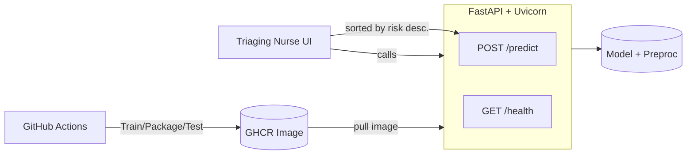

# Assignment 3 — MLOps: Virtual Diabetes Clinic Triage

> **Goal:** Build and ship a small ML service that predicts **short-term diabetes progression** and returns a **continuous risk score**. Everything is reproducible via **GitHub Actions**, containerized with **Docker**, and exposed as a simple HTTP API.

---

## 📌 Problem Context

**Case.** A hospital runs a *virtual diabetes clinic*. Each week, nurses review hundreds of patient check-ins (vitals, labs, lifestyle notes) to decide who needs a follow-up call. Reviews are currently manual and time-consuming.

**What we build.**
An ML service that predicts a numeric **progression index** (higher = worse), which the triage dashboard uses to sort patients by **descending risk**.

**You own:** training, packaging, testing, releasing, CI/CD, and artifacts.

---

## 🧠 Data

We use scikit-learn’s built-in **Diabetes** regression dataset as a stand-in for de-identified EHR features.

```python
from sklearn.datasets import load_diabetes

Xy = load_diabetes(as_frame=True)
X = Xy.frame.drop(columns=["target"])
y = Xy.frame["target"]  # "progression index" (higher ≈ worse)
```

* **Features** (standardized): `age, sex, bmi, bp, s1, s2, s3, s4, s5, s6`
* **Target**: `y` (continuous) — interpret as *short-term progression risk*.

> In production, we would train on real outcomes (e.g., HbA1c rise, complications). Here we map the mechanics to a safe open dataset.

---

## 🗺️ System at a Glance



---

## ✅ Acceptance Criteria (What will be tested)

1. **Pull & run images** from GHCR:

   * `ghcr.io/<org>/<repo>:v0.1`
   * `ghcr.io/<org>/<repo>:v0.2`
2. **Health check**

   * `GET /health` → `{"status":"ok","model_version":"<semver-or-hash>"}`
3. **Prediction**

   * `POST /predict` with JSON features returns a float:

     ```json
     {
       "age": 0.02, "sex": -0.044, "bmi": 0.06, "bp": -0.03,
       "s1": -0.02, "s2": 0.03, "s3": -0.02, "s4": 0.02,
       "s5": 0.02, "s6": -0.001
     }
     ```

     → `{"prediction": <float>}`

     * Exact field names and response shape are documented below.
4. **v0.2 shows justified improvement** with metrics & rationale (in `CHANGELOG.md` and GitHub Release notes).

---

## 🧪 Iteration Plan

### v0.1 — Baseline

* **Pipeline:** `StandardScaler` + **LinearRegression**
* **Metric:** RMSE on a held-out split
* **Ship:** working API, Docker image (`:v0.1`), health endpoint, JSON errors on bad input

### v0.2 — Improvement

* **Model upgrades:** try `Ridge` and/or `RandomForestRegressor`, and/or improved preprocessing
* **(Optional)** Convert to binary high-risk flag (threshold on prediction) and **calibrate**
* **Report deltas:** RMSE (and if flag added, `precision/recall@threshold`) in `CHANGELOG.md`

---

## 📦 API Contract

### `GET /health`

* **200 OK**

  ```json
  { "status": "ok", "model_version": "v0.1" }
  ```

### `POST /predict`

* **Request Body** *(all fields required; floats)*:

  ```json
  {
    "age": 0.02, "sex": -0.044, "bmi": 0.06, "bp": -0.03,
    "s1": -0.02, "s2": 0.03, "s3": -0.02, "s4": 0.02,
    "s5": 0.02, "s6": -0.001
  }
  ```

  > These are the **standardized** feature names from `load_diabetes`.

* **Response**

  ```json
  { "prediction": 123.456, "model_version": "v0.1" }
  ```

* **Errors** (observability): JSON with message & details

  ```json
  { "error": "ValidationError", "detail": "Missing field: bmi" }
  ```

**Sample cURL**

```bash
curl -s http://localhost:8080/health

curl -s -X POST http://localhost:8080/predict \
  -H "Content-Type: application/json" \
  -d '{"age":0.02,"sex":-0.044,"bmi":0.06,"bp":-0.03,"s1":-0.02,"s2":0.03,"s3":-0.02,"s4":0.02,"s5":0.02,"s6":-0.001}'
```

---

## 🚀 Quickstart (Local)

```bash
# 1) Setup
python -m venv .venv && source .venv/bin/activate
pip install -U pip
pip install -e .[dev]     # installs app, training, tests

# 2) Train baseline (v0.1)
python scripts/train.py --model linear --seed 42 --out artifacts/model_v0.1.joblib
# saves metrics to artifacts/metrics_v0.1.json

# 3) Serve
MODEL_PATH=artifacts/model_v0.1.joblib uvicorn app.main:app --host 0.0.0.0 --port 8080
```

**Makefile (optional)**

```makefile
train:
\tpython scripts/train.py --model linear --seed 42 --out artifacts/model_v0.1.joblib
serve:
\tMODEL_PATH=artifacts/model_v0.1.joblib uvicorn app.main:app --host 0.0.0.0 --port 8080
test:
\tpytest -q
docker-build:
\tdocker build -t ghcr.io/<org>/<repo>:v0.1 .
docker-run:
\tdocker run -p 8080:8080 ghcr.io/<org>/<repo>:v0.1
```

---

## 🐳 Docker

* **Self-contained** image (model baked in at build time)
* **FastAPI + Uvicorn** server
* **Exposed port:** `8080`
* **Healthcheck:** optional (recommended)

**Example**

```bash
docker build -t ghcr.io/<org>/<repo>:v0.1 --build-arg MODEL_PATH=artifacts/model_v0.1.joblib .
docker run --rm -p 8080:8080 ghcr.io/<org>/<repo>:v0.1
```

---

## 🔁 CI/CD (GitHub Actions)

* **PR/Push workflow (`.github/workflows/ci.yml`)**

  * Lint (`ruff`/`flake8`), format (`black` check), unit tests (`pytest`)
  * Quick training smoke (small split) to ensure pipeline works
  * Upload artifacts (trained model + metrics) to the workflow run

* **Tag workflow (`.github/workflows/release.yml`)** triggers on `v*` tags

  * Reproducible train with fixed seeds and pinned env
  * Build Docker image with baked-in model
  * Container smoke tests (`/health`, `/predict`)
  * Push image to **GHCR**
  * Publish **GitHub Release** with metrics + `CHANGELOG.md` entry

**Badges (optional)**

```md


```

---

## 🔬 Reproducibility

* **Seeds:** fixed everywhere (`numpy`, `sklearn`, training script)
* **Environment pinned:** `requirements.txt` / `poetry.lock`
* **Deterministic splits:** `train_test_split(random_state=42)`
* **Artifacts:** `artifacts/model_*.joblib`, `artifacts/metrics_*.json`
* **Docs:** exact run commands in this README

---

## 📈 Metrics & Evidence

* **Primary metric:** RMSE (regression)
* **v0.2** (if you add a high-risk flag): report **precision/recall@threshold** and how threshold chosen (e.g., optimize F1 or recall).
* Add a side-by-side table in `CHANGELOG.md`:

```md
## [v0.2] - 2025-10-13
### Changed
- Switched LinearRegression → Ridge(alpha=1.0) and added feature scaling refinements.
- RMSE improved: **v0.1 = 58.2 → v0.2 = 55.7** (−4.3%)
- Rationale: Ridge reduces variance; cross-val suggested best alpha≈1.0.

| Version | Model                | RMSE | Notes                 |
|--------:|----------------------|-----:|-----------------------|
| v0.1    | LinearRegression     | 58.2 | baseline              |
| v0.2    | Ridge(alpha=1.0)     | 55.7 | better generalization |
```

---

## 🧩 Project Structure

```
.
├─ app/
│  ├─ main.py            # FastAPI app (health/predict)
│  ├─ schemas.py         # Pydantic request/response models
│  └─ model_io.py        # load model/preproc from disk
├─ scripts/
│  └─ train.py           # training entrypoint (saves model + metrics)
├─ tests/
│  ├─ test_api.py        # API contract & error cases
│  └─ test_train.py      # training smoke tests
├─ artifacts/            # saved models + metrics (ignored in git, attached in releases)
├─ Dockerfile
├─ requirements.txt / pyproject.toml
├─ CHANGELOG.md
└─ README.md
```

---

## 🔒 Non-Functional Requirements

* **Portability:** Docker image is self-contained (model baked in)
* **Observability:** All errors return structured **JSON**
* **Reproducibility:** Same code + GH Actions retrain & rebuild deterministically

---

## 📝 Grading Rubric (Mapping)

* **CI pipeline quality (3.0):** PR/push runs lint/tests, uploads artifacts; tag workflow builds image, runs container smoke tests, publishes Release & GHCR
* **Training & reproducibility (2.0):** fixed seeds, pinned env, metrics logged/saved, clear local reproduction instructions
* **Docker image quality (2.0):** model baked in, fast start, correct port, slim/multi-stage, optional healthcheck
* **Iteration quality & evidence (2.0):** clear v0.1 → v0.2 improvements + `CHANGELOG.md` deltas
* **Docs & collaboration (1.0):** this README with exact commands & sample payload; tidy commits/PRs

---

## 📨 Hand-in

* **Public GitHub repository URL** (upload the link in PDF)
* **Actions tab must show:**

  * **PR/Push workflow**: lint, tests, quick training smoke, artifacts
  * **Tag workflow (`v*`)**: build Docker, container smoke tests, push to GHCR, publish Release with metrics/changelog

---
